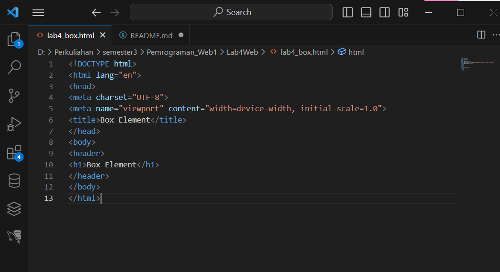
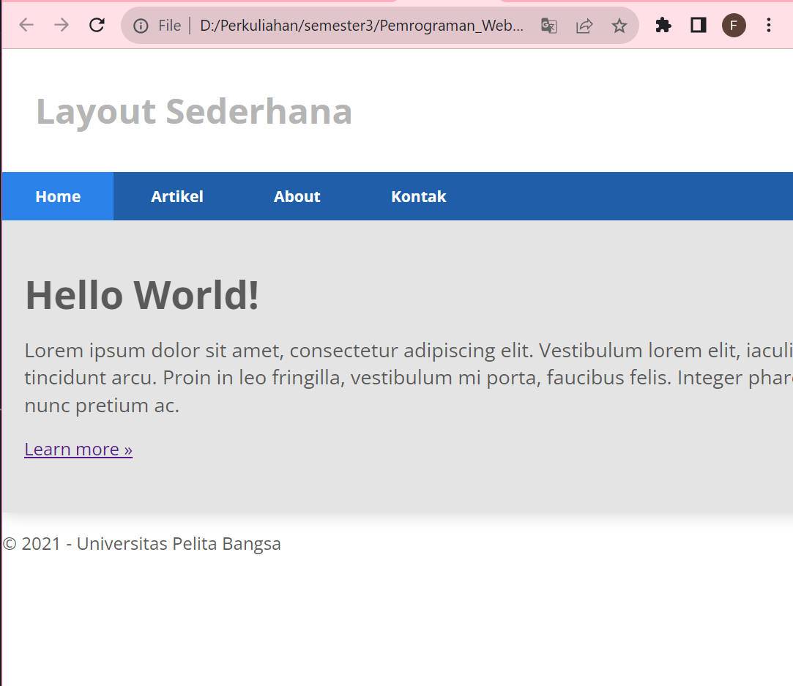
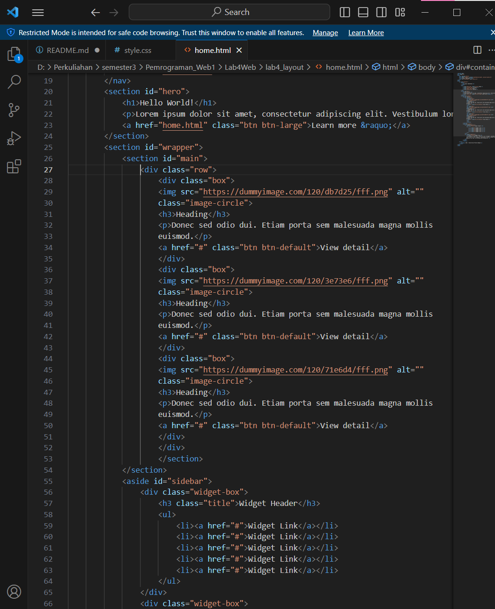
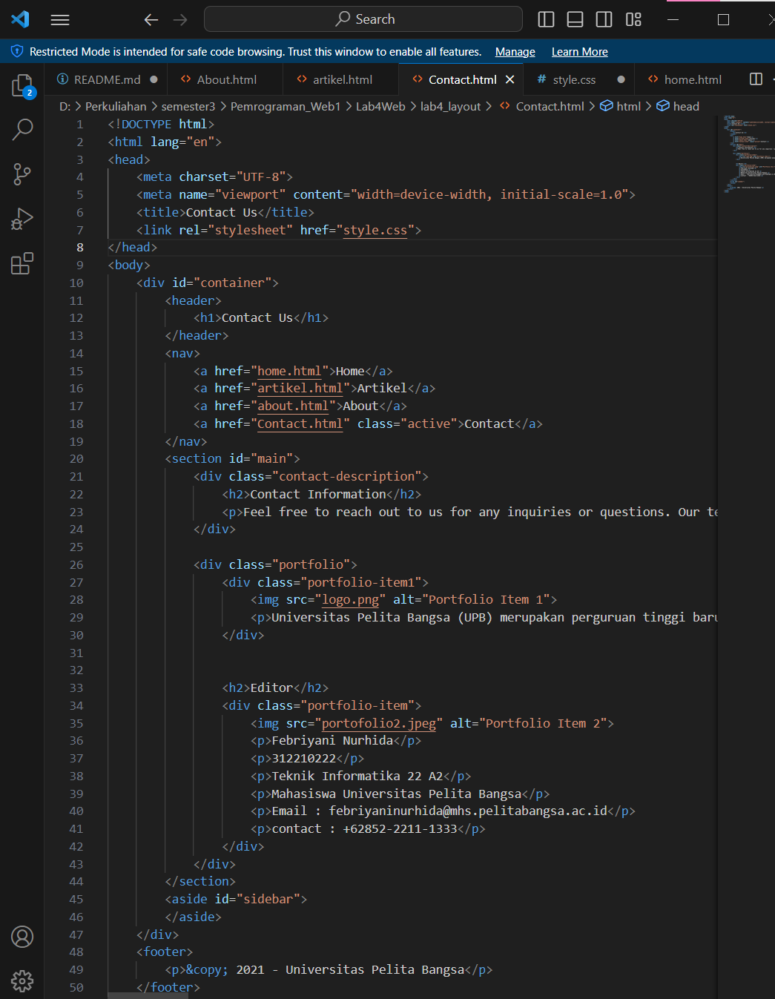

```
Febriyani Nurhida
312210222
TI.22.A2
```


# CSS Layout

## Langkah-langkah Praktikum
Persiapan membuat dokumen HTML dengan nama file lab4_box.html seperti berikut.

```html
<!DOCTYPE html>
<html lang="en">
<head>
<meta charset="UTF-8">
<meta name="viewport" content="width=device-width, initial-scale=1.0">
<title>Box Element</title>
</head>
<body>
<header>
<h1>Box Element</h1>
</header>
</body>
</html>
```




hasilnya:


## Membuat Box Element
Kemudian tambahkan kode untuk membuat box element dengan tag div seperti berikut.

```html
<section>
<div class="div1">Div 1</div>
<div class="div2">Div 2</div>
<div class="div3">Div 3</div>
</section>
```


hasilnya :


## CSS Float Property
Selanjutnya tambahkan deklarasi CSS pada head untuk membuat float element, seperti berikut.

```html
CSS Float Property
<style>
div {
float:left;
padding: 10px;
}
.div1 {
background: red;
}
.div2 {
background: yellow;
}
.div3 {
background: green;
}
</style>
```


hasilnya:


## Mengatur Clearfix Element
Clearfix digunakan untuk mengatur element setelah float element. Property clear digunakan untuk mengaturnya.
Tambahkan element div lainnya seteleah div3 seperti berikut.

```html
<section>
<div class="div1">Div 1</div>
<div class="div2">Div 2</div>
<div class="div3">Div 3</div>
<div class="div4">Div 4</div>
</section>
```
Kemudian atur property clear pada CSS, seperti berikut.


hasilnya:


Lakukan eksperimen terhadap penggunaan property clear dengan nilai lainnya (left, both, right), dan amati perubahannya.


1. clear : both

```css
.div4 {
    background-color: blue;
    clear: both;
    float: none;
}
```


2. clear: right

```css
.div4 {
    background-color: blue;
    clear: right;
    float: none;
}
```

hasilnya:


## Membuat Layout Sederhana
Kita akan membuat layout web sederhana seperti gambar berikut.


Buat folder baru dengan nama lab4_layout, kemudian buatlah file baru didalamnya dengan nama home.html, dan file css dengan nama style.css.


```html
<!DOCTYPE html>
<html lang="en">
<head>
    <meta charset="UTF-8">
<meta name="viewport" content="width=device-width, initial-scale=1.0">
<title>Layout Sederhana</title>
<link rel="stylesheet" href="style.css">
</head>
<body>
<div id="container">
</div>
</body>
</html>
```

Kemudian buat kerangka layout dengan semantics element seperti berikut.


kemudian tulis kode berikut.

```html
<header>
<h1>Layout Sederhana</h1>
</header>
<nav>
<a href="home.html" class="active">Home</a>
<a href="artikel.html">Artikel</a>
<a href="about.html">About</a>
<a href="kontak.html">Kontak</a>
</nav>
<section id="hero"></section>
<section id="wrapper">
<section id="main"></section>
<aside id="sidebar"></aside>
</section>
<footer>
<p>&copy; 2021 - Universitas Pelita Bangsa</p>
</footer>
```


Kemudian buka browser dan lihat hasilnya.


Kemudian tambahkan kode CSS untuk membuat layoutnya.

```css
/* import google font */
@import
url('https://fonts.googleapis.com/css2?family=Open+Sans:ital,wght@0,300;0,400;0,600;0,700;0,800;1,300;1,400;1,600;1,700;1,800&display=swap');
@import
url('https://fonts.googleapis.com/css2?family=Open+Sans+Condensed:ital,wght@0,300;0,700;1,300&display=swap');
/* Reset CSS */
* {
margin: 0;
padding: 0;
}
body {
line-height:1;
font-size:100%;
font-family:'Open Sans', sans-serif;
color:#5a5a5a;
}
#container {
width: 980px;
margin: 0 auto;
box-shadow: 0 0 1em #cccccc;
}
/* header */
header {
padding: 20px;
}
header h1 {
margin: 20px 10px;
color: #b5b5b5;
}
```


Kemudian lihat hasilnya pada browser.


## Membuat Navigasi
Kemudian selanjutnya mengatur navigasi.

```css
/* navigasi */
nav {
display: block;
background-color: #1f5faa;
}
nav a {
padding: 15px 30px;
display: inline-block;
color: #ffffff;
font-size: 14px;
text-decoration: none;
font-weight: bold;
}
nav a.active,
nav a:hover {
background-color: #2b83ea;
}
```


Kemudian lihat hasilnya.


## Membuat Hero Panel.
Selanjutnya membuat hero panel. Tambahkan kode HTML dan CSS seperti berikut.

```html
<section id="hero">
<h1>Hello World!</h1>
<p>Lorem ipsum dolor sit amet, consectetur adipiscing elit. Vestibulum lorem
elit, iaculis innisl volutpat, malesuada tincidunt arcu. Proin in leo fringilla,
vestibulum mi porta, faucibus felis. Integer pharetra est nunc, nec pretium nunc
pretium ac.</p>
<a href="home.html" class="btn btn-large">Learn more &raquo;</a>
</section>
```

```css
/* Hero Panel */
#hero {
background-color: #e4e4e5;
padding: 50px 20px;
margin-bottom: 20px;
}
#hero h1 {
margin-bottom: 20px;
font-size: 35px;
}
#hero p {
margin-bottom: 20px;
font-size: 18px;
line-height: 25px;
}
```


kemudian lihat hasilnya:




## Mengatur Layout Main dan Sidebar
Selanjutnya mengatur main content dan sidebar, tambahkan CSS float.

```css
/* main content */
#wrapper {
    margin: 0;
    }
    #main {
        float: left;
        width: 640px;
        padding: 20px;
        }
        /* sidebar area */
        #sidebar {
        float: left;
        width: 260px;
        padding: 20px;
        }
```


## Membuat Sidebar Widget
Kemudian selanjutnya menambahkan element lain dalam sidebar.

```html
<aside id="sidebar">
<div class="widget-box">
<h3 class="title">Widget Header</h3>
<ul>
<li><a href="#">Widget Link</a></li>
<li><a href="#">Widget Link</a></li>
<li><a href="#">Widget Link</a></li>
<li><a href="#">Widget Link</a></li>
<li><a href="#">Widget Link</a></li>
</ul>
</div>
<div class="widget-box">
<h3 class="title">Widget Text</h3>
<p>Vestibulum lorem elit, iaculis in nisl volutpat, malesuada tincidunt
arcu. Proin in leo fringilla, vestibulum mi porta, faucibus felis. Integer
pharetra est nunc, nec pretium nunc pretium ac.</p>
</div>
</aside>
```


Kemudian tambahkan CSS.

```css
/* widget */
.widget-box {
    border:1px solid #eee;
    margin-bottom:20px;
    }
    .widget-box .title {
    padding:10px 16px;
    background-color:#428bca;
    color:#fff;
    }
    .widget-box ul {
    list-style-type:none;
    }
    .widget-box li {
    border-bottom:1px solid #eee;
}
.widget-box li a {
padding:10px 16px;
color:#333;
display:block;
text-decoration:none;
}
.widget-box li:hover a {
background-color:#eee;
}
.widget-box p {
padding:15px;
line-height:25px;
}
```


kemudian lihat hasilnya:


## Mengatur Footer
Selanjutnya mengatur tampilan footer. Tambahkan CSS untuk footer.

```css
/* footer */
footer {
clear:both;
background-color:#1d1d1d;
padding:20px;
color:#eee;
}
```


hasilnya:


## Menambahkan Elemen lainnya pada Main Content

```html
<section id="main">
<div class="row">
<div class="box">

<h3>Heading</h3>
<p>Donec sed odio dui. Etiam porta sem malesuada magna mollis
euismod.</p>
<a href="#" class="btn btn-default">View detail</a>
</div>
<div class="box">

<h3>Heading</h3>
<p>Donec sed odio dui. Etiam porta sem malesuada magna mollis
euismod.</p>
<a href="#" class="btn btn-default">View detail</a>
</div>
<div class="box">

<h3>Heading</h3>
<p>Donec sed odio dui. Etiam porta sem malesuada magna mollis
euismod.</p>
<a href="#" class="btn btn-default">View detail</a>
</div>
</div>
</section>
```





Kemudian tambahkan CSS.

```css
/* box */
.box {
display:block;
float:left;
width:33.333333%;
box-sizing:border-box;
-moz-box-sizing:border-box;
-webkit-box-sizing:border-box;
padding:0 10px;
text-align:center;
}
.box h3 {
margin: 15px 0;
}
.box p {
line-height: 20px;
font-size: 14px;
margin-bottom: 15px;
}
box img {
border: 0;
vertical-align: middle;
}
.image-circle {
border-radius: 50%;
}
.row {
margin: 0 -10px;
box-sizing: border-box;
-moz-box-sizing: border-box;
-webkit-box-sizing: border-box;
}
.row:after, .row:before,
.entry:after, .entry:before {
content:'';
display:table;
}
.row:after,
.entry:after {
clear:both;
}
```


hasilnya:


## Menambahkan Content Artikel
Selanjutnya membuat content artikel. Tambahkan HTML berikut pada main content.

```html
<hr class="divider" />
<article class="entry">
<h2>First featurette heading.</h2>

<p>Lorem ipsum dolor sit amet, consectetur adipiscing elit. Vestibulum lorem
elit, iaculis in nisl volutpat, malesuada tincidunt arcu. Proin in leo fringilla,
vestibulum mi porta, faucibus felis. Integer pharetra est nunc, nec pretium nunc
pretium ac.</p>
</article>
<hr class="divider" />
<article class="entry">
<h2>First featurette heading.</h2>

<p>Lorem ipsum dolor sit amet, consectetur adipiscing elit. Vestibulum lorem
elit, iaculis in nisl volutpat, malesuada tincidunt arcu. Proin in leo fringilla,
vestibulum mi porta, faucibus felis. Integer pharetra est nunc, nec pretium nunc
pretium ac.</p>
</article>
```


Kemudian tambahkan CSS.

```css
.divider {
border:0;
border-top:1px solid #eeeeee;
margin:40px 0;
}
/* entry */
.entry {
margin: 15px 0;
}
.entry h2 {
margin-bottom: 20px;
}
.entry p {
line-height: 25px;
}
.entry img {
float: left;
border-radius: 5px;
margin-right: 15px;
}
.entry .right-img {
float: right;
}
```


hasilnya:


# Pertanyaan dan Tugas
1. Tambahkan Layout untuk menu About
=> buat single layout yang berisi deskripsi, portfolio, dll
jawab :

buat dulu halaman HTML terpisah seperti di bawah:

```html
<!DOCTYPE html>
<html lang="en">
<head>
    <meta charset="UTF-8">
    <meta name="viewport" content="width=device-width, initial-scale=1.0">
    <title>About Us</title>
    <link rel="stylesheet" href="style.css">
</head>
<body>
    <div id="container">
        <header>
            <h1>About Us</h1>
        </header>
        <nav>
            <a href="home.html">Home</a>
            <a href="artikel.html">Artikel</a>
            <a href="about.html" class="active">About</a>
            <a href="Contact.html">Contact</a>
        </nav>
        <section id="main">
            <h2>Our Story</h2>
            <p>Lorem ipsum dolor sit amet, consectetur adipiscing elit. Vestibulum lorem elit, iaculis in nisl volutpat, malesuada tincidunt arcu. Proin in leo fringilla, vestibulum mi porta, faucibus felis. Integer pharetra est nunc, nec pretium nunc pretium ac.</p>

            <h2>Our Portfolio</h2>
            <ul>
                <li>
                    <h3>Project 1</h3>
                    <p>Hello World</p>
                </li>
                
                <li>
                    <h3>Project 2</h3>
                    <p>widget-box</p>
                </li>
                <li>
                    <h3>Project 3</h3>
                    <p>Feature Heading</p>
                </li>
            </ul>
        </section>
        <section id="sidebar" class="about-sidebar">
            <h2>Our Team</h2>
            <ul class="team-grid">
                <li>
                    
                    <h3>Team Member 1</h3>
                    <p>Kim Jennie</p>
                    <p>CEO</p>
                </li>
                <li>
                    
                    <h3>Team Member 2</h3>
                    <p>Kim Jisoo</p>
                    <p>COO</p>
                </li>
                <li>
                    
                    <h3>Team Member 3</h3>
                    <p>Park Chaeyeong</p>
                    <p>CTO</p>
                </li>
                <li>
                    
                    <h3>Team Member 4</h3>
                    <p>Lalisa Manoban</p>
                    <p>Co-Founder</p>
                </li>
            </ul>
        </section>
        
    </div>
    <footer>
        <p>&copy; 2021 - Universitas Pelita Bangsa</p>
    </footer>
</body>
</html>

```


hasilnya :


2. Tambahkan layout untuk menu Contact
=> yang berisi form isian: nama, email, message, dll

```html
<!DOCTYPE html>
<html lang="en">
<head>
    <meta charset="UTF-8">
    <meta name="viewport" content="width=device-width, initial-scale=1.0">
    <title>Contact Us</title>
    <link rel="stylesheet" href="style.css">
</head>
<body>
    <div id="container">
        <header>
            <h1>Contact Us</h1>
        </header>
        <nav>
            <a href="home.html">Home</a>
            <a href="artikel.html">Artikel</a>
            <a href="about.html">About</a>
            <a href="Contact.html" class="active">Contact</a>
        </nav>
        <section id="main">
            <div class="contact-description">
                <h2>Contact Information</h2>
                <p>Feel free to reach out to us for any inquiries or questions. Our team is here to assist you with anything you need.</p>
            </div>

            <div class="portfolio">
                <div class="portfolio-item1">
                                       
                    <p>Universitas Pelita Bangsa (UPB) merupakan perguruan tinggi baru hasil perubahan bentuk dari penggabungan antara Sekolah Tinggi Ilmu Ekonomi (STIE) dan Sekolah Tinggi Teknik (STT) sesuai dengan Surat Keputusan Menteri Pendidikan Nasional Republik  Indonesia Nomor : 664/KPTI/I/2019 tanggal 2 Agustus 2019. UPB berdiri pada hamparan lahan seluas 11.603 m2yang beralamatkan di Jalan Inpeksi Kalimalang Tegal Danas Arah DELTAMAS, Cikarang Pusat – Kabupaten Bekasi,yang mana berada di tengah-tengah Pusat Segitiga Emas LIPPO Cikarang/ Meikarta, Jababeka, Delta Mas yang dikelilingi oleh Kawasan Industri terbesar di Asia Tenggara</p>
                </div>


                <h2>Editor</h2>
                <div class="portfolio-item">
                    
                    <p>Febriyani Nurhida</p>
                    <p>312210222</p>
                    <p>Teknik Informatika 22 A2</p>
                    <p>Mahasiswa Universitas Pelita Bangsa</p>
                    <p>Email : febriyaninurhida@mhs.pelitabangsa.ac.id</p>
                    <p>contact : +62852-2211-1333</p>
                </div>
            </div>
        </section>
        <aside id="sidebar">
        </aside>
    </div>
    <footer>
        <p>&copy; 2021 - Universitas Pelita Bangsa</p>
    </footer>
</body>
</html>
```




hasilnya :


3. di sini saya juga mengisi artikel dengan membuat halaman artikel.

```html
<!DOCTYPE html>
<html lang="en">
<head>
    <meta charset="UTF-8">
    <meta name="viewport" content="width=device-width, initial-scale=1.0">
    <title>Artikel</title>
    <link rel="stylesheet" href="style.css">
</head>
<body>
    <div id="container">
        <header>
            <h1>Artikel</h1>
        </header>
        <nav>
            <a href="home.html">Home</a>
            <a href="artikel.html" class="active">Artikel</a>
            <a href="about.html">About</a>
            <a href="Contact.html">Contact</a>
        </nav>
        <section id="main">
            <article>
                <h2>Judul Artikel 1</h2>
                <p>
                    Ini adalah konten artikel pertama. Artikel ini berisi tentang topik tertentu dan bisa memiliki banyak paragraf yang menjelaskan topik tersebut.
                </p>
            </article>
            <article>
                <h2>Judul Artikel 2</h2>
                <p>
                    Artikel kedua membahas topik yang berbeda. Artikel- artikel ini dapat memiliki gambar, daftar, tautan, dan elemen-elemen HTML lainnya.
                </p>
            </article>
            <article>
                <h2>Judul Artikel 3</h2>
                <p>
                    Artikel ketiga adalah tentang topik yang lebih mendalam. Ini mungkin mencakup penjelasan teknis atau informasi yang lebih rinci.
                </p>
            </article>
            <div id="related-articles">
                <h2>Artikel Terkait</h2>
                <ul>
                    <li><a href="#">Cara Membuat Website</a></li>
                    <li><a href="#">Pengenalan HTML dan CSS</a></li>
                    <li><a href="#">Tips Desain Web yang Baik</a></li>
                    <li><a href="#">Mengoptimalkan SEO</a></li>
                </ul>
            </div>
        </section>
    </div>
    <footer>
        <p>&copy; 2021 - Universitas Pelita Bangsa</p>
    </footer>
</body>
</html>
```


dan ini hasilnya:


